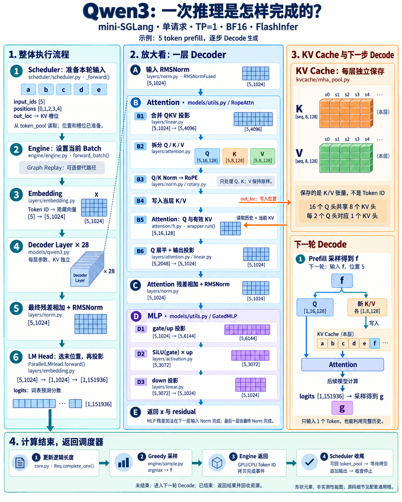

# Week 1 - 跑通 Qwen3 推理，理解模型执行与 KV Cache

## 一、启动命令与推理配置

### 1.1 启动命令

MINISGL_DISABLE_OVERLAP_SCHEDULING=1 python -m minisgl \
  --model /root/rivermind-data/Qwen3-0.6B \
  --host 127.0.0.1 \
  --port 1919 \
  --dtype bfloat16 \
  --attention-backend fi \
  --cuda-graph-max-bs 0 \
  --max-running-requests 4 \
  --max-seq-len-override 2048 \
  --memory-ratio 0.7

### 1.2 推理假设与模型参数

假设哈，模型是Qwen3.5-0.6B，单卡TP=1，输入Token数量：5，关闭CUDA Graph、Overlap，没有prefix cache
config.py中的内容
hidden_size: 1024，num_attention_heads: 16，num_k_v_heads: 8, head_dim: 128, intermediate_size: 3072, num_hidden_layers: 28, vocab_size = 151936


## 二、模型初始化与本轮输入准备

### 2.1 Engine 准备模型和运行资源

engine.py先准备模型和运行资源
创建GPU、Stream、Context -> 根据配置创建 Qwen3 模型结构 -> 读取权重，完成切分和合并 -> 把权重装入模型 -> 分配 KV cache 和 page_table -> 创建 Attention 后端和采样器
暂时无法在飞书文档外展示此内容


### 2.2 Scheduler 准备输入张量

scheduler.py 准备本轮的输入到底是哪些token
假设输入的 5 个 Token ID 是：[a, b, c, d, e]
调度器需要准备好三个张量，
- input_ids：输入什么 Token。
- positions：它在请求中的哪个位置。
- out_loc：这个 Token 的 KV 要写到哪个缓存槽位。
batch.input_ids = [a, b, c, d, e]       
batch.positions = [0, 1, 2, 3, 4]       
batch.out_loc   = [s0, s1, s2, s3, s4] 
然后调用self.engine.forward_batch(batch, sample_args)


### 2.3 Engine 将 Batch 交给模型

engine.py再把batch交给模型
也就是下面这段代码
with self.ctx.forward_batch(batch):
    logits = self.model.forward()
qwen3.py会通过下面的代码拿到输入
output = self.model.forward(
    get_global_ctx().batch.input_ids
)
input_ids：[5]这个时候就被放入模型了


## 三、Embedding：Token ID 转为隐藏向量

embedding.py
放入模型的第一步就是 Embedding，把输入的token转化为1024维的向量
这里会发生推理过程的第一次张量形状转换
本身input_ids：[5]里面是调度后输入模型的token ID，转换为输出之后的[5, 1024]
第一维代表本轮处理的Token数量，注意的是，这里的Token数量并不一定等于一次调度进入的batch数量，而且他不仅可能来自一个请求，也可能来自多个请求；第二维度表示每个Token的特征宽度


## 四、单层 Decoder Layer 的计算流程

### 4.1 Decoder Layer 的主要步骤

qwen3.py
那么当Token编码完成后，进入了Decode layer，主要步骤就是下面代码里的
x, residual = self.input_layernorm.forward(x, residual)
x = self.self_attn.forward(x)
x, residual = self.post_attention_layernorm.forward(x, residual)
x = self.mlp.forward(x)
return x, residual

### 4.2 输入 RMSNorm 与残差保留

输入 RMSNorm ：layers/norm.py
RMSNorm和layerNorm的区别：LayerNorm 减均值、除以标准差；RMSNorm 不减均值，按均方根缩放。
RMSNorm：不减均值，直接除以均方根，再缩放。
$$y_i=\gamma_i\frac{x_i}{\sqrt{\frac{1}{D}\sum_{j=1}^{D}x_j^2+\epsilon}}$$
LayerNorm：先减均值，再除以标准差，最后缩放、加偏移。
$$y_i=\gamma_i\frac{x_i-\mu}{\sqrt{\sigma^2+\epsilon}}+\beta_i$$
归一化改变数值，不改变形状，第一层的 residual 原本是 None，这里同时保留输入，也就是保留的是归一化之前的 x，供后面的残差相加使用。
也就是说输入输出的张量形状都是[5, 1024]

### 4.3 Layers 与 Models 的职责关系

为什么RMSNorm、QKV投影都是每个模型推理必须的步骤，这里我却把相关文件写在layers和models\utils.py里面?
[图片]
QKV 投影本身也实现在 layers/linear.py,models/utils.py 只是创建并调用它：
#### models/utils.py：组装 Attention 组件
self.qkv_proj = LinearQKVMerged(...)

def forward(self, x):
    qkv = self.qkv_proj.forward(x)  # 具体线性计算在 layers/linear.py
    o = self.attn.forward(qkv)
    return self.o_proj.forward(o)
RMSNorm 也是同样的关系：
#### models/qwen3.py：组装 Decoder Layer
self.input_layernorm = RMSNormFused(...)

#### 具体归一化计算在 layers/norm.py
所以可以这样记：
layers 提供积木，也就是计算，models/utils.py 拼出常用组件，qwen3.py 决定整个模型怎么连接。

### 4.4 合并 QKV 投影与张量形状

QKV投影 ：在models/utils.py里面的RopeAttn.forward()：qkv = self.qkv_proj.forward(x)然后去调用layers/linear.py
首先要明确的是QKV 并不是分开投影的，而是在权重加载的时候，将QKV的权重拼接成qkv_proj.weight的作用，也就是说只需要一次乘法就可以完成QKV的投影，这也减少了多次乘法的调度开销，本身GPU就很擅长做这种操作
三个投影的输出宽度分别是：Q：16 × 128 = 2048、K： 8 × 128 = 1024、V： 8 × 128 = 1024
16是Q 的注意力头数量，8是K/V 各自的注意力头数量，128是每个头的向量维度
也就是说啊，权重W的张量形状是[4096, 1024]，输入x的形状是[5, 1024]
X @ W.T = [5, 1024]@[1024, 4096]得到一个[5, 4096]的矩阵


### 4.5 拆分 Q、K、V 与注意力头维度

我们继续看一下：
def forward(self, x):
    qkv = self.qkv_proj.forward(x)
    o = self.attn.forward(qkv)
    return self.o_proj.forward(o)
会发现o = self.attn.forward(qkv)直接调用了layers/attention.py这个文件，而attention.py做的第一件事就是拆分Q、K、V，按照我们之前的三个投影的输出宽度分别为[2048, 1024, 1024]，所以[5, 4096]的输入矩阵，会被拆分成[5, 2048]的Q矩阵、[5, 1024]的K矩阵，[5, 1024]的V矩阵
Question：为什么Q是2048、KV是1024呢？
首先要明确的是做注意力时是 128 维的 Q 头与 128 维的 K 头匹配，不是把整个 2048 维 Q 和整个 1024 维 K 直接做点积，所以因为是16个Q头，K/V头各8个，每个头都是128维，所以才会得到2048和1024的维度数

### 4.6 Q/K Norm

接下来就是做Attention矩阵乘之前的Q/K Norm，代码把 Q、K看成多个头：
Q：[5, 2048] → [5, 16, 128]
K：[5, 1024] → [5,  8, 128]
然后对每个头的最后一维做RMSNorm归一化处理，也就是一个Token有16个Q头，每个头分别归一化自己的128个数，注意的就是这里是通过view()原地修改数据，原来的 q、k 变量仍可以保持二维形状。
self.q_norm.forward_inplace(q.view(-1, self.num_qo_heads, self.head_dim))
同时注意V不做这一步Q/K Norm：因为Q/K Norm主要是控制注意力打分的数值大小，而 V 不参与打分

### 4.7 RoPE：位置旋转与相对位置

接下来就是要做 RoPE操作：layers/rotary.py，根据 Token 的位置旋转 Q 和 K，让注意力打分能够感知 Token 之间的相对位置。
q, k = self.rotary.forward(batch.positions, q, k)
先想一个问题：Q/K投影处理的是 Token 的隐藏向量，如果没有位置机制，注意力打分本身就缺少明确的位置线索。所以 RoPE 把 positions 用到了 Q/K 上。
以现在看的 Qwen3 为例：
Q：[5, 16, 128]
K：[5,  8, 128]
positions：[0, 1, 2, 3, 4]
对每个 Token、每个头，RoPE 将 128 个数配成 64 对二维坐标，再旋转每一对，也就是 Q、K、V的头维度
那么二维旋转的公式是：
$$x^{\prime} = x \cos(\theta) - y \sin(\theta)$$
$$y^{\prime} = x \sin(\theta) + y \cos(\theta)$$
其中，RoPE 的角度由 Token 位置 × 对应坐标对的旋转频率 决定：
$$\omega_i = \frac{1}{\mathrm{base}^{2i/D}}$$
$$\theta_{p,i} = p \cdot \omega_i
             = \frac{p}{\mathrm{base}^{2i/D}}$$
- p：Token 的位置，例如 0、1、2。
- D：参与旋转的维度；这里是每个头的 128 维。
- i：坐标对编号，取 0～63。
- base：配置中的 rope_theta；Qwen3-0.6B 是 1,000,000，每个模型不一样哈，比如LLaMA就不一样
这里前后半维配对，第 i 对是：
(xᵢ, xᵢ₊₆₄)
同一个 Token 的 64 对坐标使用不同频率：
i = 0：频率 = 1，旋转角度 = p 弧度
i 越大：频率越低，随位置增长旋转得越慢
把这个角度代入之前的旋转公式就完整了：
$$x_i^{\prime}
= x_i \cos(\theta_{p,i})
- x_{i+D/2} \sin(\theta_{p,i})$$
$$x_{i+D/2}^{\prime}
= x_i \sin(\theta_{p,i})
+ x_{i+D/2} \cos(\theta_{p,i})$$
而RoPE为什么能表示Token 之间的相对位置，在于两个向量分别旋转后，它们的点积与旋转角度差有关。
比如 Q 来自位置 5，K 来自位置 2：
Q 的旋转角度：5 × 频率
K 的旋转角度：2 × 频率
角度差：(5 − 2) × 频率
因此，后面的 Q @ K.T 就能够体现两者相距 3 个位置。这不是说分数只由距离决定，Token 内容和相对位置会共同影响分数。
对应你读的代码：
q, k = self.rotary.forward(ctx.batch.positions, q, k)
调用位置是 layers/attention.py，实现在 layers/rotary.py，底层调用 FlashInfer 的旋转操作。
旋转后的 K 会写入 KV Cache，后续 Decode 的新 Q 就能与这些带位置信息的历史 K 做匹配。
给不同位置的 Q/K 施加对应旋转，RoPE并不改变形状，不增加 Token，也不处理 V；它只改变 Q/K 中的数值，所以输入和输出的张量形状没发生改变：
Q：[5, 2048] → [5, 2048]；K：[5, 1024] → [5, 1024]


### 4.8 KV Cache 的写入与存储结构

把 KV 写到 KV cache 里，然后计算 Attention ：minisgl/attention/fi.py
fi.py就是 FlashInfer
先写入当前层的缓存：self.kvcache.store_kv(k, v, batch.out_loc, layer_id)
KV Cache 中存的是 K/V 的浮点数张量
“属于哪个请求、哪个 Token”由外面的索引表管理，而“属于哪一层”由缓存张量的层维度区分。
也就是说，本质上KV cache 分为 KV pool 和 page_table，KV pool 存数据，page_table 存前者
举个例子，这个mini-SGLang里的KV Cache的形状是[2, num_layers, num_pages, page_size, num_kv_heads, head_dim]
也就是说每层的 KV 需要去每层的地方取，是不同的存储位置

### 4.9 使用 Q 与缓存中的 K/V 计算 Attention

然后就可以使用 Q 和缓存中的 K/V 去算 Attention了：
FlashInfer 路径，是先把当前 K/V 写入缓存，再让 Attention 从缓存读取
现在的 Q 的形状是 [5, 16, 128]，也就是说每个 Q 头的形状都是[5, 128]，所以在计算之前，我们需要把 Q 的形状变成[16, 5, 128]，也就是把头维度提前，同时因为全部 16 个 Q 头时，8 个 K/V 头分别被两个 Q 头共享，所以 K/V 需要在逻辑上重复到 16 个头，其实也不一定真的复制
本质上 Q @ K.T，是 Q的头 与 K的头 之间的矩阵乘法，所以其实这里的公式是：
scores = Q_head @ K_head.T
所以本质上的形状变化是[5, 128] @ [128, 5] → [5, 5]
scores矩阵的形状本质上是[本轮 Query 数量, 可供该请求使用的 Key 数量]，表示的是第 i 个 Token 的 Q 与第 j 个 Token 的 K 有多匹配
用权重对 V 加权求和，也就是O_head = weights @ V_head
形状上就是[5, 5] @ [5, 128] → [5, 128]，还是以头为单位去计算，最后我们得到所有的头的计算结果拼接在一起是[16, 5, 128]，在换回 Token 之前的布局[5, 16,128]

### 4.10 Attention 输出展平与 O 投影

O 展平，再做 O 投影：layers/attention.py
因为 O 的权重 W 张量形状是 [1024, 2048]，所以需要在利用view()回[5, 2048]
形状变化也就是[5, 16, 128] → view → [5, 2048]
再回到models/utils.py来看就是return self.o_proj.forward(o)
O @ WO.T = [5, 2048]@[2048, 1024]得到一个[5, 1024]的矩阵，回到了模型隐藏维度 1024。

### 4.11 Attention 残差相加与 RMSNorm

接下来是残差相加、RMSNorm 和 MLP的内容，主要数学公式就是下边这个
x, residual = self.post_attention_layernorm.forward(x, residual)
在调用之前，x 是 Attention 经过输出投影后的结果：x = O @ W_O.T ，形状是[5, 1024]
residual 保存的是当前 Decoder 层的输入，也就是进入 Attention 前做 RMSNorm 之前的隐藏状态，形状同样为 [5, 1024]。
第一层是在输入 Norm 时直接保留它；后续层是在输入 Norm 时先完成上一层的残差相加，再保留它。
post_attention_layernorm 实际使用 RMSNormFused，这一步等价于：
h1 = residual + x  # 当前层输入 + Attention 输出

residual = h1     # 保留相加后的结果，供后续残差连接使用
x = RMSNorm(h1)    # 归一化后送入 MLP
执行后，两者仍然都是 [5, 1024]
但 residual 保存的是 h1，x 保存的是归一化后的 h1

### 4.12 MLP 的主要步骤与 Gate/Up 投影

接着执行：x = self.mlp.forward(x)
mlp的计算主要是：
def forward(self, x):
    gate_up = self.gate_up_proj.forward(x)  # ① gate/up 投影
    y = self.act_fn(gate_up)                # ② SiLU(gate) × up
    return self.down_proj.forward(y)       # ③ down 投影
在具体的代码里，mlp.forward()的第一步就是gate/up 投影：models/utils.py：GatedMLP：gate_up = self.gate_up_proj.forward(x)
形状的变化主要是 x @ W_gate_up.T = o ，也就是[5, 1024] @ [1024, 6144] = [5, 6144]
这里的 6144 因为 gate 和 up 各需要 3072 维，

### 4.13 SiLU 激活与门控乘法

然后是激活与门控乘法：layers/activation.py
数学上相当于：
gate, up = gate_up.chunk(2, dim=-1)
y = silu(gate) * up
所以在张量形状上，我们需要先把gate_up切分成gate和up
也就是[5, 6144] = [5, 3072] + [5, 3072]
我们先看一下 SiLU 激活函数：$$\operatorname{SiLU}(x)=x\cdot\operatorname{sigmoid}(x)
=\frac{x}{1+e^{-x}}$$
激活函数不改变张量形状，所以还是[5, 3072]
然后gate和up逐元素相乘，也不改变形状，所以最后还是[5, 3072]
这里面up 负责生成中间特征，gate 负责根据输入调节这些特征，也就是门控信息，调节一下输出的内容

### 4.14 Down 投影与 MLP 残差连接

MLP的最后就是 down 投影：return self.down_proj.forward(y)
形状的变化主要是 x @ W_down.T = o ，也就是[5, 3072] @ [3072, 1024] = [5, 1024]，降低维度
然后这一层返回：
x：       MLP 输出，[5, 1024]
residual：h1，     [5, 1024]
MLP 输出与 h1 的相加，被放到下一层输入 Norm 中完成；最后一层则由最终 Norm 完成。
也就是说下一层开头的 RMSNorm 会把residual和x加起来作为新的residual去使用


## 五、多层执行、最终 Norm 与 LM Head

### 5.1 重复执行 28 层与最终 Norm

以上就是单层 Decode Layer 的计算全过程，在 Qwen3-0.6B 中有28层，所以要重复 28 层，再输出 logits，因为每层输入/输出边界都是[5, 1024]，正好闭环了，
最终 Norm 后也会得到hidden_states，形状也是[5, 1024]
最后的 hidden_states 经过 LM Head，会变成词表上的预测分数 logits


### 5.2 选取请求末位置并投影到词表

之前规定过vocab_size = 151936，所以 logits 的维度是[1, 151936]
为什么是 1，这是因为当前目的是生成“输入之后的下一个 Token”。
layers/embedding.py中的 ParallelLMHead.forward()，在 Prefill 时先取请求的最后一个位置，也就是说[5, 1024]取第4行，变成[1, 1024]
然后投影到词表：输入：[1, 1024] @ 权重.T：[1024, 151936] = logits：[1, 151936]

## 六、采样与调度器处理

### 6.1 Greedy 采样

最后采样，得到第一个输出 Token：engine/sample.py
greedy 路径：next_token = torch.argmax(logits, dim=-1)
greedy（贪心解码）就是每一步都选择 logits 分数最高的 Token，不进行随机抽样：
形状变化也就是[1, 151936] → [1]，[1]就是 token_id

### 6.2 返回 Token 并更新请求

假设选出的 Token 是 f，引擎返回 GPU 和 CPU 上的 Token ID，以及拷贝完成事件。
调度器负责：
把 f 写入 GPU token_pool
等待 CPU 拷贝完成
追加到请求输出
检查 EOS / 长度停止
返回结果或继续下一轮

## 七、从 Prefill 进入下一轮 Decode

### 7.1 下一轮输入与已有 KV Cache

之前的过程模拟的是prefill的过程，那么下一轮 Decode 如果只输入 f
则现在请求内容是：a b c d e f
但缓存状态是：a～e：KV 已有，f的KV 尚未计算
所以下一轮输入：
input_ids = [f]   # [1]
positions = [5]   # [1]
out_loc   = [s5]  # [1]

### 7.2 Decode 张量形状与历史 KV 的使用

模型里的第一维从 5 变成 1：
Embedding        [1, 1024]
QKV              [1, 4096]
Q 头视图         [1, 16, 128]
新 K/V 头视图    各 [1, 8, 128]
写入 f 的 KV 后，Attention 使用：
当前 Q：来自 f
有效 KV：来自 a、b、c、d、e、f
所以输入只有一个 Token，也能利用完整历史。
最后得到：
logits：[1, 151936]
采样： g
下一轮再输入 g，重复这个过程。

## 八、整条链路的张量形状汇总

把整条链路的张量形状变化压成一张表的话就是：

| **阶段** | **Prefill：输入 5 个 Token** | **Decode：输入 1 个 Token** |
| :---: | :---: | :---: |
| 输入 IDs | [5] | [1] |
| Embedding | [5,1024] | [1,1024] |
| QKV 投影 | [5,4096] | [1,4096] |
| Q 头视图 | [5,16,128] | [1,16,128] |
| 本轮新 K/V 头视图 | 各 [5,8,128] | 各 [1,8,128] |
| Attention 输出 | [5,16,128] | [1,16,128] |
| O 投影 | [5,1024] | [1,1024] |
| gate/up | [5,6144] | [1,6144] |
| 激活与门控 | [5,3072] | [1,3072] |
| down | [5,1024] | [1,1024] |
| 28 层后的最终 Norm | [5,1024] | [1,1024] |
| 进入 LM Head 的隐藏状态 | [1,1024] | [1,1024] |
| logits | [1,151936] | [1,151936] |
| 采样 ID | [1] | [1] |

## 九、一次模型前向的实际调用顺序

```text
scheduler/scheduler.py
Scheduler._forward()
│  从 token_pool 取出本轮 input_ids
│
└─ engine/engine.py
   Engine.forward_batch()
   │  设置当前 Batch，选择普通前向或 Graph Replay
   │
   └─ models/qwen3.py
      Qwen3ForCausalLM.forward()
      │
      ├─ Qwen3Model.forward()
      │  │
      │  ├─ layers/embedding.py
      │  │  VocabParallelEmbedding.forward()
      │  │  Token IDs → 隐藏向量
      │  │
      │  ├─ Qwen3DecoderLayer.forward() × 28 层
      │  │  │
      │  │  ├─ layers/norm.py
      │  │  │  RMSNormFused.forward()
      │  │  │  输入归一化；非首层还完成上层残差相加
      │  │  │
      │  │  ├─ models/utils.py
      │  │  │  RopeAttn.forward()
      │  │  │  │
      │  │  │  ├─ layers/linear.py
      │  │  │  │  QKV 投影 → F.linear()
      │  │  │  │
      │  │  │  ├─ layers/attention.py
      │  │  │  │  AttentionLayer.forward()
      │  │  │  │  ├─ 拆分 Q、K、V
      │  │  │  │  ├─ layers/norm.py：Q/K Norm
      │  │  │  │  ├─ layers/rotary.py：RoPE
      │  │  │  │  └─ attention/fi.py：FlashInfer 后端
      │  │  │  │     ├─ kvcache/mha_pool.py：写入当前 K/V
      │  │  │  │     └─ wrapper.run()：读取缓存，计算 Attention
      │  │  │  │
      │  │  │  └─ layers/linear.py
      │  │  │     O 投影 → F.linear()
      │  │  │
      │  │  ├─ layers/norm.py
      │  │  │  RMSNormFused.forward()
      │  │  │  Attention 残差相加 + RMSNorm
      │  │  │
      │  │  └─ models/utils.py
      │  │     GatedMLP.forward()
      │  │     ├─ layers/linear.py：gate/up 投影
      │  │     ├─ layers/activation.py：SiLU(gate) × up
      │  │     └─ layers/linear.py：down 投影
      │  │
      │  └─ layers/norm.py
      │     最后一层的 MLP 残差相加 + 最终 RMSNorm
      │
      └─ layers/embedding.py
         ParallelLMHead.forward()
         Prefill 选每个请求末位置 → F.linear() → logits

返回 engine/engine.py
│
├─ core.py：Req.complete_one() 更新请求长度
├─ engine/sample.py：Sampler.sample()
│  greedy 时执行 argmax → 下一 Token ID
└─ 返回 GPU/CPU Token IDs 和拷贝完成事件

返回 scheduler/scheduler.py
├─ 下一 Token 写回 token_pool
└─ _process_last_data()
   等待拷贝完成 → 追加输出 → 检查停止条件 → 返回结果/回收资源
```

## 十、Qwen3 推理流程总览

[](qwen3-inference-overview.png)

点击图片可打开原图，放大查看细节。
